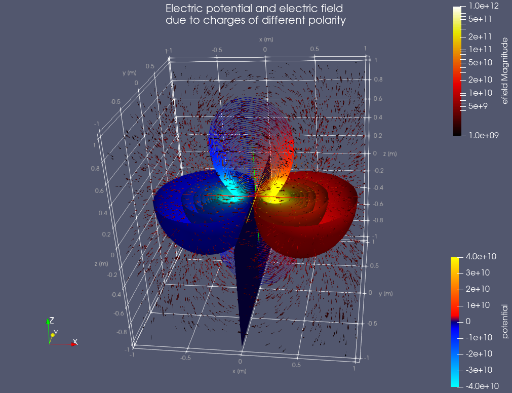

# Paraview 用のvtkファイル作成サンプル

[Paraview](https://www.paraview.org) は科学技術関連の計算結果や測定結果などを可視化することができる強力なアプリケーションである．

ここではPythonを使って作成した3次元数値データをvtkフォーマットのファイルに書き出す例として，
[pyevtk](https://github.com/paulo-herrera/PyEVTK) を用いた例をあげている．

# twoCharges.py

(-0.2, 0, 0) の -1 C，(0.2, 0, 0) に 1 Cの電荷を置いたときの電位分布および電界分布を
x, y, z 方向とも -1 mから 1 mの範囲で計算している．

```
 python3 twoCharges.py
```

でスクリプトを実行すると，```structured.vtr``` というファイルが生成される．
このファイルには ```potential``` にスカラーポテンシャル，```efield``` に電界が格納されている．

```viewstate.pvsm``` はParaviewのViewState ファイルで，
上記のスクリプトの実行で生成された```structured.vtr``` をParaviewで可視化する例．
Paraview で [File] -> [Load State...] からこのファイルを指定すると以下のような画面が表示される．
直後に [Load State Options] のダイアログが表示されるので適切なものを選ぶ．


